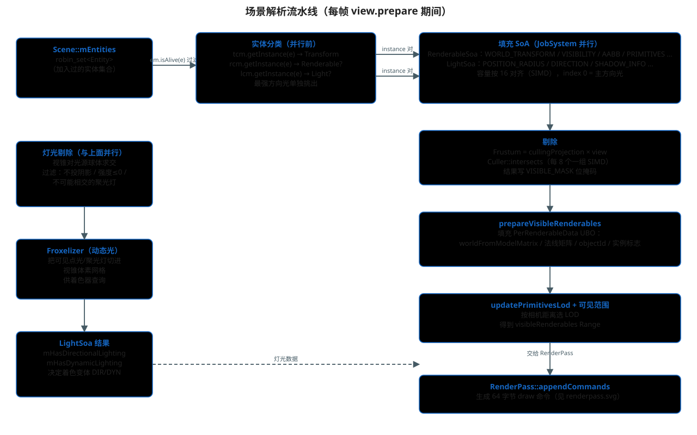

# 场景解析与剔除（Scene / View / Entity）

> 主文档：[README.md](./README.md)
>
> 本文回答：`scene->addEntity(x)` 之后，Filament 每帧是怎么知道
> "场景里有什么、哪些看得见、以什么姿态画"的。



## 1. 入口：谁触发了场景解析

场景解析发生在每帧 `FRenderer::renderJob` 里对 `view.prepare(...)` 的调用：

```cpp
// filament/filament/src/details/Renderer.cpp
view.prepare(engine, driver, rootArenaScope, svp, cameraInfo, getShaderUserTime(), needsAlphaChannel);
```

`FView::prepare`（`filament/filament/src/details/View.cpp`）内部按顺序做：

1. 计算剔除视锥 `Frustum`；
2. `scene->prepare(...)`：把实体收集成 SoA（本文第 3 节）；
3. 灯光剔除（与渲染体剔除并行，第 4 节）；
4. 可渲染体剔除（第 5 节）；
5. `scene->prepareVisibleRenderables(...)`：给可见物体准备 UBO（第 6 节）；
6. 动态光 froxelization（第 7 节）。

## 2. 底层数据结构回顾

### Entity：32 位弱引用句柄

```cpp
// libs/utils/include/utils/Entity.h
class Entity {
    Type mIdentity = 0;   // uint32_t
};
```

编码（`libs/utils/include/utils/EntityManager.h`，`GENERATION_SHIFT = 17`）：

| 位 | 含义 |
|---|---|
| 高 15 位 | generation（代数），销毁后 +1，旧句柄自动失效 |
| 低 17 位 | index，组件管理器 SoA 里的槽位 |

`EntityManager` 是全局单例；`FEngine` 持有它的引用，但**不拥有实体生命周期**。

### 组件：SingleInstanceComponentManager

`TransformManager` / `RenderableManager` / `LightManager` / `CameraManager`
都是 `SingleInstanceComponentManager` 的封装：`Entity → Instance → SoA`。

```cpp
// components/RenderableManager.h
bool hasComponent(Entity e) const noexcept { return mManager.hasComponent(e); }
Instance getInstance(Entity e) const noexcept { return { mManager.getInstance(e) }; }
```

**关键**：`Scene::prepare` 就是用这三个 `getInstance(e)` 判断实体"是什么"。

## 3. Scene::prepare：从实体集合到 SoA

`FScene` 的存储（`filament/filament/src/details/Scene.h`）：

```cpp
tsl::robin_set<Entity> mEntities;   // 场景里的实体集合
FSkybox*        mSkybox;            // 天空盒（本身也是一个实体）
FIndirectLight* mIndirectLight;     // IBL
RenderableSoa   mRenderableData;    // 每帧重建
LightSoa        mLightData;         // 每帧重建
```

`addEntity` 就一行：`mEntities.insert(entity)`。Scene 不拷贝对象、不建层级，
只是"登记"。

`FScene::prepare`（`filament/filament/src/details/Scene.cpp`）每帧做：

```cpp
for (Entity const e : entities) {
    if (UTILS_LIKELY(em.isAlive(e))) {
        auto ti = tcm.getInstance(e);
        auto li = lcm.getInstance(e);
        auto ri = rcm.getInstance(e);
        if (li) { /* 进 lightInstances；最强方向光单独挑出 */ }
        if (ri) { renderableInstances.emplace_back(ri, ti); }
    }
}
```

然后并行填充两个 SoA。`RenderableSoa` 的列（`Scene.h` 里的枚举）：

| 列 | 内容 |
|---|---|
| `RENDERABLE_INSTANCE` | Renderable 组件实例 |
| `WORLD_TRANSFORM` | 世界矩阵（double→float） |
| `VISIBILITY_STATE` | 16 位可见性位域（投阴影/收阴影/剔除/蒙皮/变形…） |
| `SKINNING_BUFFER` / `MORPHING_BUFFER` | 蒙皮/变形绑定 |
| `INSTANCES` | 实例化信息 |
| `WORLD_AABB_CENTER` / `WORLD_AABB_EXTENT` | 世界 AABB（供剔除） |
| `VISIBLE_MASK` | 各 pass 的可见位（剔除结果） |
| `CHANNELS` / `LAYERS` | 通道、图层 |
| `PRIMITIVES` / `SUMMED_PRIMITIVE_COUNT` | LOD 后的图元切片 |
| `UBO` | PerRenderableData（着色器数据） |

`LightSoa` 同理，且 **index 0 固定放主方向光**（`DIRECTIONAL_LIGHTS_COUNT = 1`），
没有方向光时该槽位是无效实例。容量按 16 对齐（SIMD 循环需要）。

> ⚠️ 这些 SoA 只在"一次 view pass"内有效。同一个 Scene 被多个 View 使用时，
> 每个 View 渲染时都会重新 `prepare` 覆盖数据。

## 4. 灯光剔除

`prepareVisibleLights`（`View.cpp`）：

1. `Culler::intersects` 对视锥和光源球体求交（`POSITION_RADIUS`）；
2. 过滤：不投射阴影的光、强度 ≤ 0 的光；
3. 聚光灯额外做"是否可能与视锥相交"的锥面测试；
4. 结果决定 `mHasDynamicLighting`（有可见点光/聚光）和
   `mHasDirectionalLighting`（index 0 方向光有效），进而决定着色器变体
   `DYN` / `DIR`。

## 5. 可渲染体剔除

```cpp
// View.cpp
void FView::prepareVisibleRenderables(JobSystem& js, Frustum const& frustum,
        FScene::RenderableSoa& renderableData) const noexcept {
    if (UTILS_LIKELY(isFrustumCullingEnabled())) {
        cullRenderables(js, renderableData, frustum, VISIBLE_RENDERABLE_BIT);
    } else {
        // 关闭剔除：全部标记可见
    }
}

void FView::cullRenderables(...) {
    // 用世界 AABB 中心 + 半宽对视锥求交
    Culler::intersects(visibleArray, frustum,
            worldAABBCenter, worldAABBExtent, count, bit);
}
```

`Culler::intersects` 每次处理 8 个 AABB（SIMD），结果写进 `VISIBLE_MASK`。
这是一个位掩码，每一位代表"在某个 pass 中可见"：

- `VISIBLE_RENDERABLE_BIT`：主颜色 pass 可见；
- `VISIBLE_DIR_SHADOW_CASTER_BIT`：参与方向光阴影；
- `VISIBLE_SPOT_SHADOW_CASTER_BIT`：参与聚光灯阴影。

### 图层的第二道过滤

即使通过视锥剔除，还要满足：

```text
(renderable.layerMask & view.visibleLayers) != 0
```

`FView::setVisibleLayers` 设置 View 的可见层；Renderable 用
`RenderableManager::setLayerMask` 设置自己的图层。两边不匹配 → 不渲染。

## 6. prepareVisibleRenderables：填 UBO

```cpp
// Scene.cpp
void FScene::prepareVisibleRenderables(Range<uint32_t> visibleRenderables) noexcept {
    for (uint32_t const i : visibleRenderables) {
        PerRenderableData& uboData = sceneData.elementAt<UBO>(i);
        // worldFromModelMatrix
        // worldFromModelNormalMatrix（非均匀缩放处理 + 预缩放）
        // flagsChannels（蒙皮/变形/实例/通道打包）
        // objectId = 实体 id
        // userData（当前存局部缩放，供 glTF 使用）
    }
}
```

每个可见物体一份 `PerRenderableData`，之后作为 UBO 上传 GPU。

## 7. Froxelizer：动态光的 3D 切分

当有可见动态光时，`mFroxelizer.prepare(...)` 按视锥把空间切成
一个 3D 网格（froxel），每个格子记录会照到它的光源列表。
着色器里按像素所在格子查表得到光照贡献。这是 Filament 动态光性能的关键。

## 8. 常见问题

- **加物体不显示**：查 `em.isAlive(e)`、`rcm.getInstance(e)` 是否有效、
  `view->setScene(scene)` 是否调用、`layerMask & visibleLayers` 是否匹配。
- **物体在相机背后仍被渲染**：检查 `RenderableManager::Builder::culling(false)`
  是不是被设了（本项目 hello triangle 就设了 `culling(false)`）。
- **一个 Scene 多个 View**：SoA 会被逐 View 覆盖，别在 View 之间共享已收集数据。
- **方向光只有一个**：多方向光只保留强度最大的那个（`maxIntensity` 逻辑）。

## 源码位置

- `filament/filament/src/details/Scene.h` / `Scene.cpp`
- `filament/filament/src/details/View.h` / `View.cpp`
- `filament/filament/src/Culler.h` / `Culler.cpp`
- `filament/filament/src/components/TransformManager.h` / `RenderableManager.h` / `LightManager.h`
- `filament/libs/utils/include/utils/Entity.h` / `EntityManager.h`
