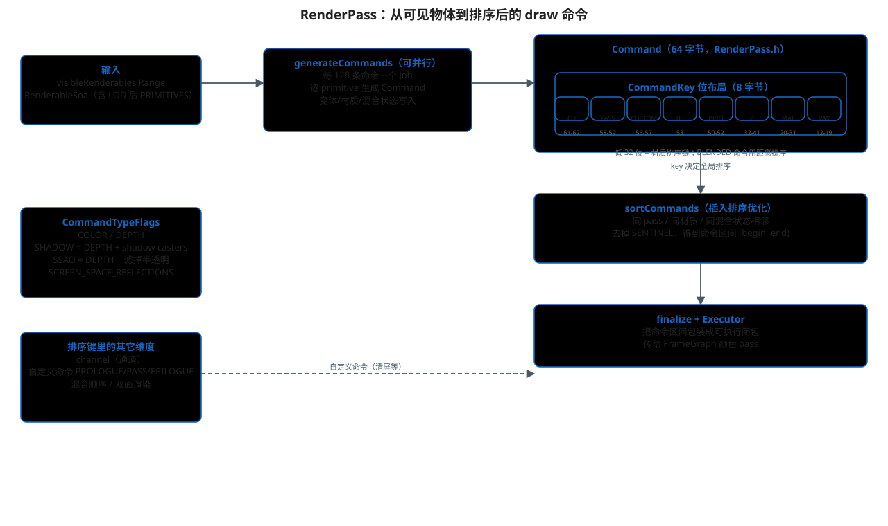

# RenderPass：draw 命令的生成、排序与执行

> 主文档：[README.md](./README.md)
>
> 本文回答：剔除完之后，"这一帧要画哪些 draw call、按什么顺序画"，
> 是如何被描述成一条条 64 字节命令的。



## 1. 定位

`RenderPass` 不是"一次渲染 pass"本身，而是**一个可复用的命令生成器**：

- 输入：可见 renderable 范围（`Range<uint32_t>`）+ `RenderableSoa`；
- 输出：一段排序好的 `Command[]`（每条 64 字节）；
- 消费：`RenderPass::Executor` 把命令区间包装成闭包，交给 FrameGraph 的
  颜色 pass / 阴影 pass 执行。

阴影 pass 和颜色 pass 都各自构建一个 `RenderPass`，只是 `CommandTypeFlags`
和 `Variant` 不同。

## 2. Command：64 字节的结构

```cpp
// filament/filament/src/RenderPass.h
struct alignas(8) Command {     // 64 字节
    CommandKey key = 0;         // 8 字节：排序键
    PrimitiveInfo info;         // 56 字节：画什么
};
```

`PrimitiveInfo`（56 字节）字段：

| 字段 | 大小 | 含义 |
|---|---|---|
| `mi` | 8 | 材质实例指针 |
| `rph` | 4 | RenderPrimitive 句柄（几何） |
| `vbih` / `dsh` | 4+4 | 顶点缓冲信息 / 描述符集句柄 |
| `indexOffset` / `indexCount` | 4+4 | 索引范围 |
| `index` | 4 | 命令编号（调试） |
| `skinningOffset` / `morphingOffset` | 4+4 | 蒙皮/变形偏移 |
| `rasterState` | 4 | 光栅状态（面剔除、多边形偏移…） |
| `instanceCount` | 2 | 实例数 |
| `materialVariant` | 1 | 着色变体（DIR/DYN/SHADOW…） |
| 位域 | 3+1+1+1 | 图元类型 / 蒙皮 / 变形 / 混合实例化 |

## 3. CommandKey：8 字节排序键

位布局（`RenderPass.h` 里的常量，高位在左）：

```text
63  62-61  60  59-58  57-56  55-54  53  52-50  49-42  41-32  31-20  19-12  11-0
│   CHANNEL │   PASS   CUSTOM    │ BL  PRIORITY │ Z_BUCKET MAT_ID VARIANT INST_ID
```

| 字段 | 位 | 说明 |
|---|---|---|
| `CHANNEL` | 61-62 | 渲染通道（不透明/透明…） |
| `PASS` | 58-59 | DEPTH / COLOR / REFRACT / BLENDED |
| `CUSTOM` | 56-57 | PROLOGUE / PASS / EPILOGUE（自定义命令） |
| `BLENDING` | 53 | 是否混合 |
| `PRIORITY` | 50-52 | 优先级（`setPriority`） |
| `Z_BUCKET` | 32-41 | 深度桶（不透明物体按深度分桶） |
| `MATERIAL_ID` | 20-31 | 材质 id（`makeMaterialSortingKey`） |
| `VARIANT` | 12-19 | 着色变体 |
| `INSTANCE_ID` | 0-11 | 材质实例 id |

半透明命令用 `BLEND_ORDER` / `BLEND_DISTANCE`（16-47 位）按距离排序，
代替材质键。`CommandKey` 是 64 位整数，**比较一次就能得到全局顺序**，
排序用针对近有序数组的插入排序（`sortCommands`）。

## 4. 生成流程

`RenderPass::appendCommands`（`RenderPass.cpp`）：

```cpp
void RenderPass::appendCommands(...) {
    // 1. 空场景：只放 SENTINEL 命令
    // 2. 逐 visible renderable 生成命令（>128 条时并行，128 条一个 job）
    // 3. 末尾追加 SENTINEL（Pass::SENTINEL，保证排序在最后）
    // 4. 主线程上为每条命令 prepareProgram（编译/准备着色器变体）
}
```

`generateCommands` 对每个 primitive 做：

- 读取材质实例的混合/面剔除/深度测试状态，写入 `rasterState`；
- 双面渲染（`TWO_PASSES_TWO_SIDES`）会生成两条命令；
- 阴影相关：`SHADOW` 标志时半透明物体被过滤（`DEPTH_FILTER_ALPHA_MASKED_OBJECTS`
  等由 `CommandTypeFlags` 控制）；
- 用 `makeMaterialSortingKey(materialId, instanceId)` 和 pass/channel/priority
  拼出 `key`。

## 5. 排序与 Executor

```text
Command[]（乱序）── sortCommands ──> 有序区间 [begin, end)
                                          │
                                          ▼
                              RenderPass::Executor（持有命令区间）
                                          │
                    RendererUtils::colorPass(fg, "Color Pass", ..., pass.getExecutor())
                                          │
                                          ▼
                              FrameGraph pass 的 execute 闭包
```

`finalize(engine, driver)` 做收尾（比如把 `CustomCommand` 的函数表装好）。
执行时 `Executor::execute` 遍历命令区间，对每条命令：

1. 绑定材质实例、图元、描述符集；
2. 调用 `driverApi.draw(...)` —— **这一步才把 draw 命令写进命令流**。

## 6. 自定义命令

`appendCustomCommand` 生成 PROLOGUE / PASS / EPILOGUE 三类自定义命令：

- PROLOGUE：pass 前执行（例如清深度）；
- EPILOGUE：pass 后执行（例如色彩分级 subpass）；
- PASS：普通命令。

本项目里 `renderJob` 就用了 EPILOGUE 挂色彩分级（`colorGradingSubpass`）和
自定义 resolve subpass。

## 7. 常见问题

- **为什么命令是 64 字节对齐结构体**：为 cache line 友好 + 允许并行生成后
  原地排序，避免指针间接。
- **排序键里没有相机距离**：不透明物体按材质/深度桶排序（尽量合并状态），
  只有半透明物体才按距离排序，这是 Filament 减少状态切换的核心手段。
- **命令属于哪次渲染**：命令生成在 CPU 阶段，执行在 FrameGraph execute 阶段，
  两者之间命令驻留在 per-frame Arena（见 [04-arena.md](./04-arena.md)）。

## 源码位置

- `filament/filament/src/RenderPass.h` / `RenderPass.cpp`
- `filament/filament/src/details/Renderer.cpp`（`renderJob` 中 shadow/color pass 的组装）
