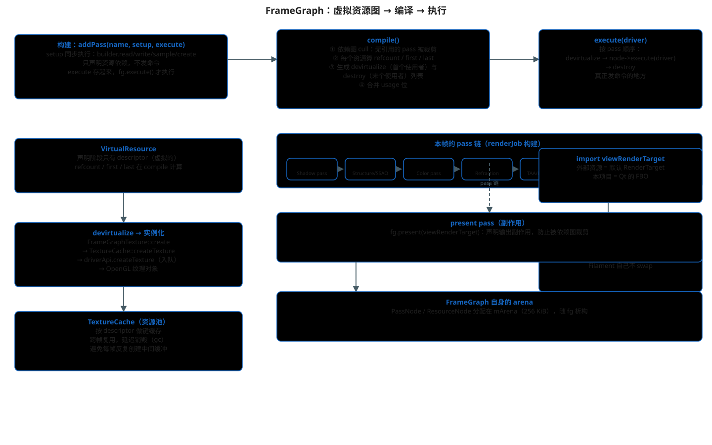

# FrameGraph：虚拟资源图、编译与执行

> 主文档：[README.md](./README.md)
>
> 本文回答：后处理链上"影子贴图 → 颜色缓冲 → 各种临时纹理"这些资源，
> 什么时候创建、什么时候销毁、pass 按什么顺序跑，Filament 用一张
> "帧图"（FrameGraph）来统一管理。



## 1. 为什么需要 FrameGraph

一帧里有很多中间缓冲：阴影贴图、SSAO 结果、HDR 颜色缓冲、TAA 历史、
bloom 的各层 mip……如果每个 pass 自己创建/销毁，会：

- 同一帧里反复创建同尺寸纹理（浪费）；
- 依赖顺序写死，没法裁剪不需要的 pass；
- 资源生命周期难以跨帧复用。

FrameGraph 的做法：**先声明后执行**。

## 2. addPass：声明与执行分离

```cpp
// filament/filament/src/fg/FrameGraph.h
fg.addPass<PassData>("Pass Name",
    [&](Builder& builder, auto& data) {
        // setup：同步执行，声明资源依赖
        color = builder.write(color, COLOR_ATTACHMENT);
        depth = builder.read(depth, SAMPLEABLE);
        builder.declareRenderPass(...);
    },
    [=](FrameGraphResources const& resources, auto const&, DriverApi& driver) {
        // execute：fg.execute() 阶段执行，这里才发命令
        driver.beginRenderPass(...);
        driver.draw(...);
        driver.endRenderPass();
    });
```

**setup 捕获按引用、execute 捕获按拷贝**——因为 setup 同步执行，
execute 要等到 `fg.execute()`（可能换线程）才跑。

## 3. 资源与依赖图

`VirtualResource`（`fg/details/Resource.h`）：

```cpp
class VirtualResource {
    uint32_t refcount = 0;
    PassNode* first = nullptr;   // 第一个使用的 pass（在这里 devirtualize）
    PassNode* last  = nullptr;   // 最后一个使用的 pass（在这里 destroy）
    virtual void devirtualize(ResourceCreationContext const&) noexcept = 0;
    virtual void destroy(ResourceCreationContext const&) noexcept = 0;
};
```

构建期只有 descriptor（虚拟资源，未分配 GPU 内存）。`Builder::read/write` 会
在依赖图（`DependencyGraph`）里加边：pass → 资源（写）、资源 → pass（读）。

## 4. compile()：裁剪与生命周期

```cpp
// filament/filament/src/fg/FrameGraph.cpp
FrameGraph& FrameGraph::compile() noexcept {
    // ① 依赖图裁剪：没有被任何 active pass 引用的 pass 直接砍掉
    dependencyGraph.cull();

    // ② 稳定分区：active pass 排前面
    // ③ 每个 active pass 收集它读/写的资源，registerResource
    // ④ 每个资源算 refcount，找到 first/last 使用者
    //    first->devirtualize.push_back(resource)
    //    last ->destroy.push_back(resource)
    // ⑤ 合并 usage 位（COLOR_ATTACHMENT | SAMPLEABLE ...）
}
```

结果：每个 pass 挂了两张表——执行前要实例化的资源、执行后要销毁的资源。

## 5. execute()：真正跑起来

```cpp
void FrameGraph::execute(backend::DriverApi& driver) noexcept {
    for (PassNode* node : 活跃 pass) {
        for (VirtualResource* r : node->devirtualize) r->devirtualize(context);
        node->execute(resources, driver);   // 执行 pass 闭包 → 发命令
        for (VirtualResource* r : node->destroy) r->destroy(context);
    }
}
```

`devirtualize` 对纹理来说就是：

```text
FrameGraphTexture::create
  → TextureCache::createTexture
    → driverApi.createTexture(...)   // 入队，见 05-command-stream.md
```

## 6. TextureCache：资源池

`Renderer::mResourceAllocator` 是 `TextureCache`
（`filament/filament/src/TextureCache.h`）：

- 以 `(target, levels, format, samples, width, height, depth, usage, swizzle)`
  为键缓存纹理；
- 纹理销毁走 `TextureCacheDisposer`，延迟 `cacheMaxAge` 帧真正释放，
  便于下一帧复用；
- 每帧 `endFrame` 里 `mResourceAllocator->gc()` 回收。

这是"每帧大量中间纹理却不卡顿"的关键。

## 7. 本项目：输出如何落到 Qt FBO

`renderJob` 里（`details/Renderer.cpp`）：

```cpp
auto [viewRenderTarget, attachmentMask] = getRenderTarget(view);
FrameGraphId<FrameGraphTexture> const fgViewRenderTarget =
        fg.import("viewRenderTarget", {...}, viewRenderTarget);
// ... 后处理链最后 ...
fg.forwardResource(fgViewRenderTarget, input);
fg.present(fgViewRenderTarget);
fg.compile();
fg.execute(driver);
```

关键点：

- `getRenderTarget(view)` 没有自定义 RenderTarget 时返回"默认 render target"，
  对应 OpenGL 后端的默认 framebuffer，即本项目的 Qt FBO；
- `import` 把外部资源引入帧图（不归帧图创建/销毁）；
- `forwardResource` 把后处理输出"转发"成该资源的新版本；
- `present` 声明副作用，防止依赖图把它裁剪掉；
- **Filament 自己不 swap**——Qt 的合成器负责呈现。

## 8. 常见问题

- **pass 被裁剪**：没有任何资源引用（且非 side-effect）的 pass 不会执行，
  所以想强制执行的调试 pass 要 `sideEffect()`。
- **资源版本**：`read/write` 返回新句柄，旧句柄失效；调试时把 `FrameGraphHandle`
  当普通指针理解会踩坑。
- **fgviewer**：`FILAMENT_ENABLE_FGVIEWER` 开启时可在运行时查看帧图
  （`fgviewer::DebugServer`），是调试 pass 裁剪的利器。

## 源码位置

- `filament/filament/src/fg/FrameGraph.h` / `.cpp`
- `filament/filament/src/fg/details/Resource.h`（`VirtualResource`）
- `filament/filament/src/fg/FrameGraphTexture.cpp`（纹理实例化）
- `filament/filament/src/TextureCache.h`（资源池）
- `filament/filament/src/details/Renderer.cpp`（`renderJob` 的组装与输出转发）
