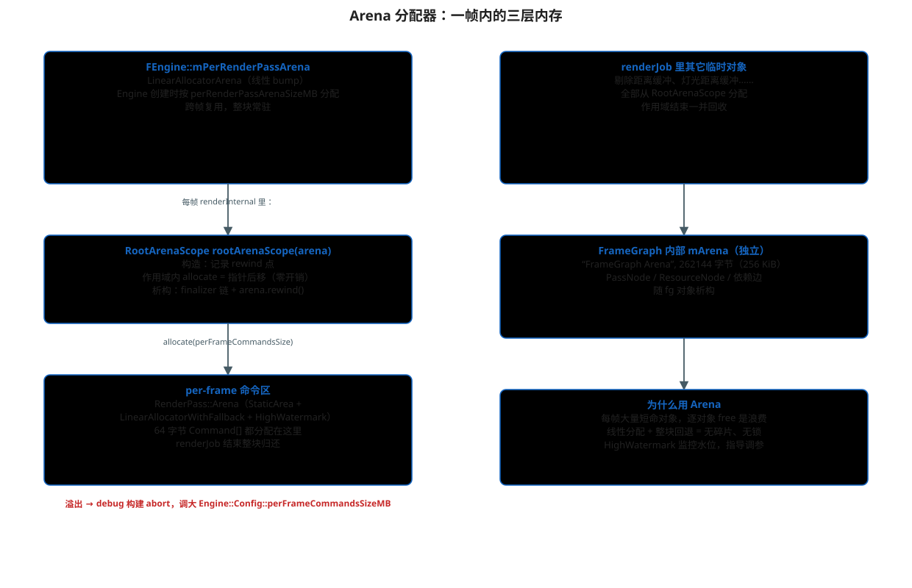

# Arena 分配器：一帧内的三层内存

> 主文档：[README.md](./README.md)
>
> 本文回答：每帧成千上万的临时对象（draw 命令、UBO、剔除缓冲、FrameGraph
> 节点）从哪来、什么时候释放，为什么 Filament 不用逐对象 new/free。



## 1. 核心思想

Filament 对"每帧短命数据"用**线性分配器（Linear Allocator）+ 整块回退（rewind）**：

- 分配：把"当前指针"往后挪（bump），O(1)，无锁；
- 释放：不逐对象 free，作用域结束把指针回退到记录点，一次性归还；
- 效果：无碎片、无分配器锁竞争、缓存友好。

这套机制在源码里叫 `Arena` / `ArenaScope`（不是"Area"）。

## 2. 三层结构

### 第一层：FEngine::mPerRenderPassArena

```cpp
// filament/filament/src/details/Engine.h
RootArenaScope::Arena mPerRenderPassArena;   // LinearAllocatorArena

// Allocators.h
using LinearAllocatorArena = utils::Arena<
        utils::LinearAllocator,
        utils::LockingPolicy::NoLock,
        utils::TrackingPolicy::DebugAndHighWatermark>;
using RootArenaScope = utils::ArenaScope<LinearAllocatorArena>;
```

- Engine 构造时按 `perRenderPassArenaSizeMB` 分配一块常驻内存；
- 每帧 `FRenderer::renderInternal` 里：

```cpp
RootArenaScope rootArenaScope(engine.getPerRenderPassArena());
```

`ArenaScope` 构造时记录 `getCurrent()` 作为 rewind 点；析构时先跑
finalizer 链（非平凡析构的对象），再 `arena.rewind(mRewind)`。

### 第二层：per-frame 命令区

```cpp
// details/Renderer.cpp（renderJob 内）
size_t const perFrameCommandsSize = engine.getPerFrameCommandsSize();
void* const arenaBegin = rootArenaScope.allocate(perFrameCommandsSize, CACHELINE_SIZE);
RenderPass::Arena commandArena("Command Arena", { arenaBegin, arenaEnd });
```

`RenderPass::Arena`：

```cpp
using Arena = utils::Arena<
        utils::LinearAllocatorWithFallback,   // 命令区不够时回退堆分配
        utils::LockingPolicy::NoLock,
        utils::TrackingPolicy::HighWatermark,
        utils::AreaPolicy::StaticArea>;
```

[02-renderpass.md](./02-renderpass.md) 里的 64 字节 `Command[]`
全部分配在这里。源码注释："allocated commands ARE NOT freed,
they're owned by the Arena"。`renderJob` 结束，随 `RootArenaScope`
析构整块归还。

### 第三层：FrameGraph 内部 arena

```cpp
// fg/FrameGraph.cpp
mArena("FrameGraph Arena", 262144)   // 256 KiB
```

`PassNode` / `ResourceNode` / 依赖边都从这里分配，随 `fg` 对象析构。
它独立于 per-render-pass arena，因为 FrameGraph 可能被复用/调试工具持有。

## 3. ArenaScope 语义（Allocator.h）

```cpp
template<typename ARENA>
class ArenaScope {
    explicit ArenaScope(ARENA& allocator)
            : mArena(allocator), mRewind(allocator.getCurrent()) {}
    ~ArenaScope() {
        // 1. 跑 finalizer 链（析构非平凡对象）
        // 2. mArena.rewind(mRewind) —— 整块回退
    }
};
```

`ArenaScope::make<T>(...)` 对平凡可析构类型直接 bump；对非平凡类型
登记 finalizer，作用域结束时按注册顺序调用析构。

## 4. 配置与监控

相关配置（`filament/filament/include/filament/Engine.h`）：

| 配置 | 默认基准 | 作用 |
|---|---|---|
| `perRenderPassArenaSizeMB` | `FILAMENT_PER_RENDER_PASS_ARENA_SIZE_IN_MB`（3） | 第一层总大小 |
| `perFrameCommandsSizeMB` | `FILAMENT_PER_FRAME_COMMANDS_SIZE_IN_MB`（2） | 每帧命令区大小 |
| `minCommandBufferSizeMB` | `FILAMENT_MIN_COMMAND_BUFFERS_SIZE_IN_MB`（1） | 后端环形缓冲保证空间（见 05） |

`validateConfig`（`Engine.cpp`）强制 `perRenderPassArenaSizeMB ≥ perFrameCommandsSizeMB + 1`。

监控：

- Debug 构建用 `TrackingPolicy::DebugAndHighWatermark` 记录水位；
- 每帧结束 `recordHighWatermark(commandArena.getListener().getHighWatermark())`；
- 命令区溢出时 debug 构建 abort，提示调大 `perFrameCommandsSizeMB`；
- 环形缓冲溢出时后端 POSTCONDITION 报错，提示调大 `minCommandBufferSizeMB`。

## 5. 常见问题

- **为什么命令区要 16 字节对齐**：SIMD 剔除循环、cache line 对齐需要；
- **为什么不能手动 free 单个命令**：线性分配器没有 free 概念，
  手动释放会被忽略或破坏 rewind 语义；
- **Arena 内对象不能跨帧持有**：下一帧 rewind 后指针失效，
  这是"per-render-pass 数据只在 pass 内有效"的底层原因。

## 源码位置

- `filament/filament/src/Allocators.h`（类型别名）
- `filament/libs/utils/include/utils/Allocator.h`（`Arena` / `ArenaScope` / `LinearAllocator`）
- `filament/filament/src/details/Engine.h` / `Engine.cpp`（arena 创建与配置钳制）
- `filament/filament/src/details/Renderer.cpp`（`RootArenaScope` 与命令区）
- `filament/filament/src/RenderPass.h`（`RenderPass::Arena`）
