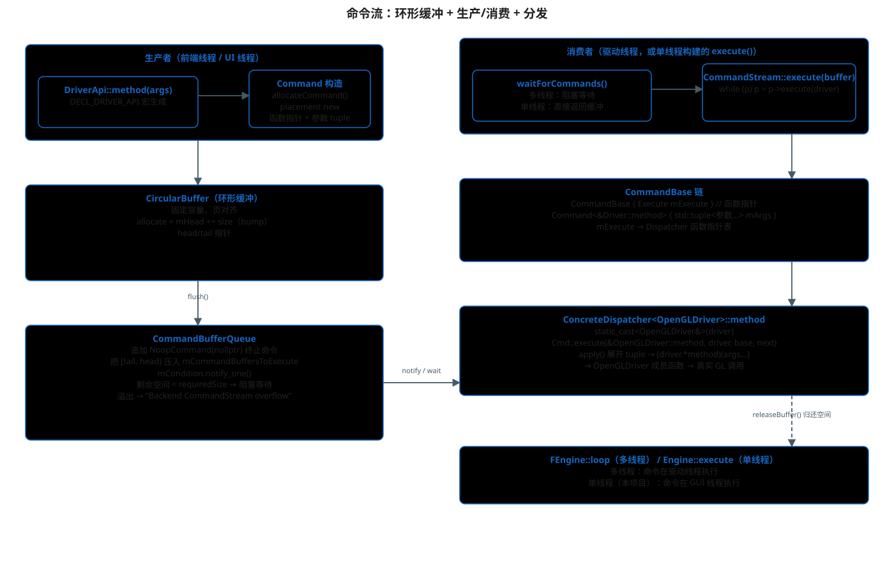

# 命令流：环形缓冲、生产消费与 Dispatcher 分发

> 主文档：[README.md](./README.md)
>
> 本文回答：前端调用的 `driverApi.xxx(...)` 到底发生了什么，
> 命令长什么样，谁在哪个线程执行，最后怎么命中 `OpenGLDriver` 的成员函数。



## 1. 一句话总结

```text
DriverApi（CommandStream）把 "函数指针 + 参数 tuple" 写进环形缓冲
  → CommandBufferQueue.flush() 切段并通知
    → 消费者（驱动线程 / 单线程 execute）逐条执行
      → Dispatcher 函数指针 → OpenGLDriver 成员函数 → 真实 GL 调用
```

## 2. 写命令：DECL_DRIVER_API 宏

`DriverApi` 是 `CommandStream` 的别名。`CommandStream.h` 里用宏给每个
`Driver` 方法生成一个内联封装：

```cpp
#define DECL_DRIVER_API(methodName, paramsDecl, params)                        \
    inline void methodName(paramsDecl) noexcept {                              \
        using Cmd = COMMAND_TYPE(methodName);                                  \
        void* const p = allocateCommand(CommandBase::align(sizeof(Cmd)));      \
        new(p) Cmd(mDispatcher.methodName##_, APPLY(std::move, params));       \
    }
```

展开后，一次 `driverApi.createTexture(...)` 等价于：

1. `allocateCommand(n)`：在 `CircularBuffer` 里线性分配 n 字节；
2. placement new 一个 `Command<&Driver::createTexture>`；
3. 构造函数保存 `mDispatcher.createTexture_`（函数指针）和
   `SavedParameters = std::tuple<参数...>`。

`COMMAND_TYPE(method)` 展开为：

```cpp
CommandType<decltype(&Driver::method)>::Command<&Driver::method>
```

即每个 Driver 方法一个模板实例，参数类型在编译期写死在 tuple 里。

### 同步 API

`DECL_DRIVER_API_SYNCHRONOUS` 的方法**不入队**，直接调用
`apply(&Driver::method, mDriver, args)`（例如 `terminate`、`debugThreading`）。

## 3. 命令对象：函数指针 + 参数

```cpp
// CommandStream.h
class CommandBase {
    using Execute = Dispatcher::Execute;   // void(*)(Driver&, CommandBase*, intptr_t*)
    Execute mExecute;                       // 命令头，每个命令的第一个字段

    CommandBase* execute(Driver& driver) {
        intptr_t next;
        mExecute(driver, this, &next);      // 调用具体分发函数
        return reinterpret_cast<CommandBase*>(
                reinterpret_cast<intptr_t>(this) + next);   // 跳到下一条
    }
};

template<void(Driver::*)(ARGS...)>
class Command : public CommandBase {
    using SavedParameters = std::tuple<std::remove_reference_t<ARGS>...>;
    SavedParameters mArgs;
};
```

命令在缓冲里**连续排列**，靠"返回下一条偏移"串联，没有链表指针，
这对 cache 和 SIMD 都友好。

## 4. 环形缓冲：CircularBuffer + CommandBufferQueue

### CircularBuffer

```cpp
// private/backend/CircularBuffer.h
void* allocate(size_t s) noexcept {
    char* const cur = mHead;
    mHead = cur + s;      // bump 分配
    return cur;
}
```

固定容量、页对齐，head/tail 指针管理已写/未消费区间。

### CommandBufferQueue::flush

```cpp
// backend/src/CommandBufferQueue.cpp
void CommandBufferQueue::flush() {
    // 追加 NoopCommand(nullptr)：本段命令的终止符（执行循环靠它停）
    new(circularBuffer.allocate(sizeof(NoopCommand))) NoopCommand(nullptr);

    auto const [begin, end] = circularBuffer.getBuffer();
    mCommandBuffersToExecute.push_back({ begin, end });
    mCondition.notify_one();

    if (mFreeSpace < requiredSize) {
        // 空间不足：阻塞等消费者 releaseBuffer()
        mCondition.wait(lock, [this, requiredSize] {
            return mFreeSpace >= requiredSize;
        });
    }
}
```

`mRequiredSize = minCommandBufferSizeMB * MiB`，`bufferSize` 默认
`minCommandBufferSizeMB * 3`（三帧容量）。溢出时 POSTCONDITION：

```text
"Backend CommandStream overflow ... increase minCommandBufferSizeMB"
```

## 5. 执行命令：CommandStream::execute

```cpp
void CommandStream::execute(void* buffer) {
    mDriver.execute([&driver, base] {
        auto p = base;
        while (p) {
            p = p->execute(driver);   // 走完整条命令链
        }
    });
}
```

`CommandBase::execute` 调 `mExecute`——这个函数指针来自 `Dispatcher`，
在初始化时从 `ConcreteDispatcher<OpenGLDriver>::make()` 拷入每个命令。

## 6. Dispatcher：纯函数指针表

```cpp
// private/backend/Dispatcher.h
class Dispatcher {
public:
    using Execute = void (*)(Driver& driver, CommandBase* self, intptr_t* next);
#define DECL_DRIVER_API(methodName, paramsDecl, params) Execute methodName##_;
#include "DriverAPI.inc"
};
```

`ConcreteDispatcher<OpenGLDriver>`（`backend/src/CommandStreamDispatcher.h`）
为每个方法生成静态分发函数：

```cpp
static void methodName(Driver& driver, CommandBase* base, intptr_t* next) {
    using Cmd = COMMAND_TYPE(methodName);
    ConcreteDriver& concreteDriver = static_cast<ConcreteDriver&>(driver);
    Cmd::execute(&ConcreteDriver::methodName, concreteDriver, base, next);
}
```

`Cmd::execute` 展开 tuple、调用成员函数、写 `*next`、析构命令：

```cpp
template<typename M, typename D>
static void execute(M&& method, D&& driver, CommandBase* base, intptr_t* next) {
    Command* self = static_cast<Command*>(base);
    *next = align(sizeof(Command));
    apply(std::forward<M>(method), std::forward<D>(driver), std::move(self->mArgs));
    self->~Command();
}
```

于是命令最终变成：

```text
(OpenGLDriver&)driver.beginRenderPass(rth, params...)   // OpenGLDriver 成员
    └─ glBeginFramebuffer / glClear / ...               // 真实 GL
```

## 7. 谁在哪个线程执行

### 多线程构建（默认桌面）

```text
FEngine::loop（驱动线程）
  └─ FEngine::execute()
       ├─ mCommandBufferQueue.waitForCommands()   // 阻塞等待，有活才醒
       ├─ driver.execute(item.begin)              // CommandStream::execute
       └─ releaseBuffer(item)                     // 归还空间，唤醒生产者
```

### 单线程构建（本项目）

```cpp
// CommandBufferQueue.cpp
std::vector<Range> CommandBufferQueue::waitForCommands() const {
    if (!UTILS_HAS_THREADING) {
        return std::move(mCommandBuffersToExecute);   // 不阻塞，直接拿走
    }
    ...
}
```

`Engine::execute()`（`filament/filament/src/Engine.cpp`）：

```cpp
void Engine::execute() {
    FILAMENT_CHECK_PRECONDITION(!UTILS_HAS_THREADING)
            << "Execute is meant for single-threaded platforms.";
    downcast(this)->flush();
    downcast(this)->execute();
}
```

前置检查保证：单线程构建下才允许调用；命令在 GUI 线程上执行。
如果以后去掉 `FILAMENT_SINGLE_THREADED`，这一行会直接 panic，
必须改成多线程模式（不调 execute，让驱动线程跑）。

## 8. 完整一帧的入队/执行对照（本项目）

| 前端调用 | 入队的命令 | 最终命中 |
|---|---|---|
| `beginFrame(swapchain)` | `Driver::beginFrame` | `OpenGLDriver::beginFrame` |
| `render(view)` 内各 pass | `beginRenderPass` / `draw` / `endRenderPass` / `blit`… | 对应 OpenGLDriver 成员 |
| `endFrame()` | `commit` / `endFrame` | `OpenGLDriver::commit` / `endFrame` |
| `engine->execute()` | —（消费） | 上表所有命令在本线程执行 |

## 源码位置

- `filament/filament/backend/include/private/backend/CommandStream.h`
- `filament/filament/backend/src/CommandStream.cpp`
- `filament/filament/backend/include/private/backend/CommandBufferQueue.h`
- `filament/filament/backend/src/CommandBufferQueue.cpp`
- `filament/filament/backend/include/private/backend/CircularBuffer.h`
- `filament/filament/backend/include/private/backend/Dispatcher.h`
- `filament/filament/backend/src/CommandStreamDispatcher.h`
- `filament/filament/backend/include/private/backend/DriverAPI.inc`
- `filament/filament/src/Engine.cpp`（`Engine::execute`）
- `filament/filament/src/details/Engine.cpp`（`FEngine::execute` / `flushCommandBuffer`）
- `filament/filament/backend/src/opengl/OpenGLDriver.cpp`
