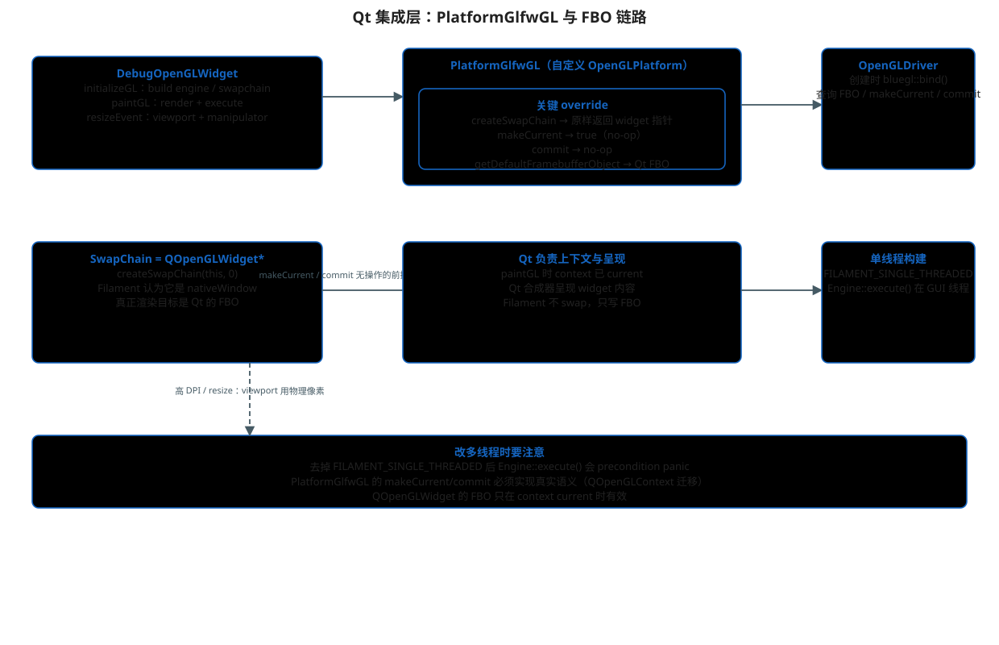

# Qt 集成层：PlatformGlfwGL、SwapChain 与 FBO 链路

> 主文档：[README.md](./README.md)
>
> 本文回答：`Qt-Filament` 项目里 Filament 是怎么"借" Qt 的 OpenGL
> 上下文和 framebuffer 完成渲染的，以及哪些代码是项目自己写的、
> 各自的职责和坑。



## 1. 本项目接入的三块自定义代码

| 文件 | 职责 |
|---|---|
| `test/debugOpenGlWidget.h/.cpp` | `QOpenGLWidget` 子类：引擎初始化、每帧渲染、交互 |
| `test/PlatformGlfwGL.h/.cpp` | 自定义 `OpenGLPlatform`：把 Filament 绑到 Qt 上下文 |
| `test/glloader.cpp` | 用 glad 加载 GL 函数（给 Qt 侧自己的 GL 调用用） |

## 2. PlatformGlfwGL：逐个方法分析

```cpp
// test/PlatformGlfwGL.cpp
Driver* PlatformGlfwGL::createDriver(void* sharedGLContext,
        const Platform::DriverConfig& driverConfig) noexcept {
    int result = bluegl::bind();     // 用 bluegl 解析当前 context 的函数
    FILAMENT_CHECK_POSTCONDITION(!result) << "Unable to load OpenGL entry points.";
    return OpenGLPlatform::createDefaultDriver(this, sharedGLContext, driverConfig);
}

Platform::SwapChain* PlatformGlfwGL::createSwapChain(
        void* nativeWindow, uint64_t flags) noexcept {
    return (SwapChain*)nativeWindow;   // 直接把 QOpenGLWidget* 当 swapchain
}

uint32_t PlatformGlfwGL::getDefaultFramebufferObject() noexcept {
    return glwidget->defaultFramebufferObject();   // 关键：告诉 Filament 画到 Qt 的 FBO
}

bool PlatformGlfwGL::makeCurrent(...) { return true; }   // no-op
void PlatformGlfwGL::commit(...) {}                       // no-op
```

含义：

- **createSwapChain**：swapchain 不需要真正的缓冲交换逻辑，只是把
  `QOpenGLWidget*` 原样返回。Filament 渲染的目标是"默认 framebuffer"，
  不是这个指针本身；
- **getDefaultFramebufferObject**：每次渲染查询 FBO id，
  返回 Qt 的 `defaultFramebufferObject()`——**这是接入成功的关键一行**；
- **makeCurrent / commit 为 no-op 的前提**：`paintGL()` 里 Qt 已经 makeCurrent，
  呈现由 Qt 合成器完成。这个前提一旦破坏（多线程、多窗口），必须实现真实语义。

## 3. 引擎初始化顺序（initializeGL）

```cpp
// test/debugOpenGlWidget.cpp
void DebugOpenGLWidget::initializeGL() {
    QOpenGLWidget::initializeGL();
    initializeOpenGLFunctions();                  // 解析 QOpenGLFunctions_4_5_Core
    OpenGLProcAddressHelper::ctx = context();
    GlLoader::CustomLoadGL(OpenGLProcAddressHelper::getProcAddress);  // glad

    startTimer(0);
    mElapsed.start();

    PlatformGlfwGL* platform = new PlatformGlfwGL();
    platform->glwidget = this;

    engine = Engine::Builder()
            .backend(Engine::Backend::OPENGL)
            .featureLevel(FeatureLevel::FEATURE_LEVEL_3)
            .config(&engineConfig)
            .platform(platform)                   // ← 关键：注入自定义平台
            .build();

    renderer = engine->createRenderer();
    scene    = engine->createScene();
    view     = engine->createView();
    swapchain = engine->createSwapChain(this, 0); // ← nativeWindow 传 widget
    ...
}
```

初始化时 OpenGL context 已经 current（QOpenGLWidget 保证），所以
`bluegl::bind()` 和 glad 都能拿到正确函数指针。

## 4. 每帧渲染（paintGL）

```cpp
void DebugOpenGLWidget::paintGL() {
    glBindFramebuffer(GL_FRAMEBUFFER, defaultFramebufferObject());  // 绑定 Qt FBO

    const double now = mElapsed.elapsed() / 1000.0;
    animate(engine, view, now, delta);

    if (renderer->beginFrame(swapchain)) {
        renderer->render(view);
        renderer->endFrame();
    }
    engine->execute();        // 单线程构建：命令在 GUI 线程执行
}
```

链路（对应 [README.md](./README.md) 的调用链图）：

```text
Qt FBO ←── Filament 默认 framebuffer ←── PlatformGlfwGL::getDefaultFramebufferObject()
swapchain = widget 指针 ←── createSwapChain(this, 0)
命令执行线程 = GUI 线程 ←── FILAMENT_SINGLE_THREADED + engine->execute()
```

## 5. 视口与交互

- `resizeEvent` 里同时更新 `view->setViewport(...)` 和
  `camutils::Manipulator::setViewport(...)`，保证鼠标坐标与渲染视口一致；
- 高 DPI 屏上建议用物理像素：`width() * devicePixelRatio()`；
- 鼠标/滚轮事件直接转发给 `camutils::Manipulator`
  （`grabBegin/grabUpdate/grabEnd/scroll`），相机矩阵每帧由
  `getLookAt` 取出。

## 6. 已知注意点

1. **OpenGL 版本**：本项目构建碰巧在机器上拿到了 4.x 兼容上下文，
   但代码里没有显式请求 4.5 core。稳妥做法是在 `main()` 里
   `QSurfaceFormat::setDefaultFormat`（4.5 + CoreProfile + depth/stencil + MSAA）；
2. **引擎清理**：`~DebugOpenGLWidget` 目前为空，engine/scene/view/材质
   都没有 `engine->destroy(...)`。单窗口退出无碍，重建 widget 会泄漏；
3. **多线程化**：去掉 `FILAMENT_SINGLE_THREADED` 后：
   - `Engine::execute()` 会 precondition panic，需删除或条件调用；
   - `PlatformGlfwGL::makeCurrent/commit` 必须实现真实的
     `QOpenGLContext` 迁移与提交；
   - 引擎命令必须在 GUI 线程写入（`debugThreading` 会校验）。

## 源码位置

- `test/debugOpenGlWidget.cpp` / `.h`
- `test/PlatformGlfwGL.cpp` / `.h`
- `test/glloader.cpp` / `.h`
- `test/main.cpp`（QApplication / 窗口装配）
