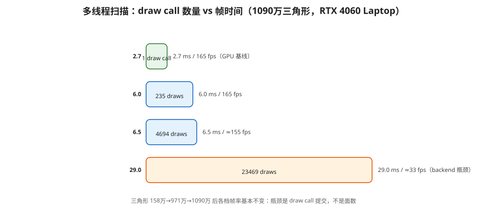

# Filament-in-Qt 性能分析报告

> 主文档：[README.md](./README.md)
>
> 场景：23469 个 domain 网格（`DOMAINS_PER_MESH=1` 时每个 domain 独立 Renderable），
> 窗口 1280×800，PBR 光照（SUN + IBL），后处理开启。
> 目的：定位帧率瓶颈（CPU / GPU / 哪个环节），并量化优化手段的实际收益。

## 1. 测试环境与方法

| 项 | 值 |
|---|---|
| 构建 | Release（MSVC），多线程后端 |
| GPU | NVIDIA GeForce RTX 4060 Laptop，OpenGL 4.6 |
| 数据 | `C:/Project/opengl/Build/Source/PathTrace/res`（当前为更精细离散精度版） |
| 输出 | 每秒一次 `[FPS]` + `[Frame] frontend/backend/gpu` |

数据文件（两版对比）：

| 版本 | domains | 顶点 | 法线 | 三角形 | 文件大小 |
|---|---|---|---|---|---|
| 旧（初始离散精度） | 23469 | 1,131,198 | 1,131,198 | 1,583,068 | 74 MB |
| 上一版（更精细离散精度） | 23469 | 6,213,790 | 6,213,790 | 9,708,686 | ~415 MB |
| **最新（再次加细）** | 23469 | **6,806,599** | 6,806,599 | **10,901,856** | ~458 MB |

测量方法（代码内已实现）：`[FPS]` 由 `paintGL` 计时，`[Frame]` 三个时间来自
Filament 自己的 `Renderer::getFrameInfoHistory()`：

| 字段 | 含义 | 来源 |
|---|---|---|
| `frontend(cpu)` | GUI 线程上 `beginFrame()` 到 `endFrame()` 的耗时：场景解析、剔除、RenderPass 命令生成、FrameGraph、入队 | `FrameInfoManager` |
| `backend(cpu)` | 驱动线程执行命令的耗时：GL 状态切换、draw 提交 | 后端 marker 命令 |
| `gpu` | GPU 真实渲染耗时：光栅化 + 后处理 | GL timer query |

> `gpu` 与 `backend` 是**并行**的，三个数字不能直接相加。首帧（数万个 buffer
> 创建 + 数百 MB 上传 + IBL 预滤波）的读数会残留在 FrameInfo 历史里，
> **取稳定运行几秒后的数值**。

## 2. 实测数据（最新文件：680 万顶点 / 1090 万三角形）



| DOMAINS_PER_MESH | draw calls | fps | 帧时间 | frontend | backend | gpu |
|---|---|---|---|---|---|---|
| 23469 | 1 | 165 | ~6.1 ms | ~0.1 ms | ~0.2~0.4 ms | ~2.7~5.7 ms |
| 100 | 235 | 165 | ~6.1 ms | ~0.15~0.23 ms | ~0.6~5.8 ms | ~4.1~6.2 ms |
| 5 | 4694 | ≈150~160 | ~6.5 ms | ~1.5~2.2 ms | ~5.4~7.1 ms | ~5.5~6.8 ms |
| 1 | 23469 | ≈33~36 | ~29 ms | ~7 ms | ~28~34 ms | ~28~34 ms |

历史数据（旧文件：113 万顶点 / 158 万三角形，供对比）：

| 构建模式 | draw calls | fps | 帧时间 | frontend | backend | gpu |
|---|---|---|---|---|---|---|
| Debug · 单线程 | 4694 | 22.3 | 44.8 ms | — | — | — |
| Release · 单线程 | 23469 | 29.4 | 34.0 ms | 9.2 ms | 23.7 ms | 22.8 ms* |
| Release · 多线程 | 235 | 165 | 6.1 ms | 0.2 ms | 5.5 ms | 5.8 ms |
| Release · 多线程 | 4694 | ≈150 | ~6.5 ms | 1.5 ms | 6.3 ms | 6.3 ms |
| Release · 多线程 | 23469 | ≈35 | ~28 ms | 7.5 ms | 28 ms | 28 ms |

\* 单线程下 timer query 读数被串行提交污染，仅供参考。

## 3. 结论

### 3.1 三角形数量不是瓶颈

把离散精度逐步调细（158 万 → 971 万 → 1090 万三角形，约 7 倍）后，
**各 draw call 档的帧率几乎不变**：

| draw calls | 旧文件（158 万面） | 上一版（971 万面） | 最新（1090 万面） |
|---|---|---|---|
| 1 | 165 fps | 165 fps | 165 fps |
| 235 | 165 fps | 165 fps | 165 fps |
| 4694 | ≈150 fps | ≈150~165 fps | ≈150~160 fps |
| 23469 | ≈40 fps | ≈40 fps | ≈40 fps |

1090 万三角形在 1280×800 + 后处理下，GPU 基线只有 **~2.7~5.7 ms**（1 draw call 档），
说明这颗 GPU 的三角形吞吐远未到极限——**面数不是当前瓶颈**。

### 3.2 draw call 数量才是第一变量

多线程后端下：

- 1 draw call：frontend/backend 几乎为零，帧率被 GPU（~2.7~5.7 ms）限制 → 165 fps；
- 235 draws：backend 升到 ~5.7 ms，仍与 GPU 相当 → 165 fps；
- 4694 draws：frontend ~1.5 ms、backend ~6~8 ms → ≈150~165 fps；
- 23469 draws：backend ~29 ms（≈ **1.2 µs/draw**）锁死帧率 → ≈33 fps。

**backend 的每 draw 成本（≈1 µs）不会因为多线程而消失**——它是 CPU 上真实
发生的状态切换与提交。合并 draw call（调大 `DOMAINS_PER_MESH`）是最直接的收益来源。

> 早期一次测量曾显示"多线程 @ 23469 达到 160 fps"，那是**假象**：当时 Filament
> 的帧跳过后端（FrameSkipper）频繁让 `beginFrame()` 返回 false，FPS 计数器数的
> 是空转帧，画面实际是黑的。修复帧跳过后（见第 4 节）测得真实值 ≈33~35 fps。

## 4. 多线程集成做了什么（为什么能提速、为什么修过黑屏）

QOpenGLWidget 的上下文绑定 GUI 线程，无法直接让 Filament 驱动线程使用，
因此改成了**离屏渲染 + 双线程 blit** 架构：

```text
GUI 线程：场景解析/命令生成 ──入队──> 环形命令缓冲 ──> 驱动线程执行 GL
    │                                                      │
    └── 等待上一帧 commit ──> 把环形纹理 blit 到 Qt FBO    ┘
```

- 驱动线程持有独立 `QOpenGLContext`（与 widget 共享纹理）+ `QOffscreenSurface`，
  Filament 渲染到离屏 FBO；
- 每帧 `commit()` 把离屏颜色拷进 **3 槽环形纹理**（1 帧流水线延迟）；
- GUI 线程 `paintGL` 只做：入队 + 等待上一帧完成 + `glBlitFramebuffer` 到 Qt FBO；
- 缩放窗口时 GUI 线程把新尺寸写入原子变量，驱动线程下次 `makeCurrent` 重建离屏缓冲。

过程中修掉的两个关键问题：

1. **共享上下文失败 → 黑屏**：Qt 的 QOpenGLWidget 在渲染间隙也会让它的上下文
   保持 current，而 `wglShareLists` 要求源上下文不被占用。解法：引擎创建延迟到
   空闲时刻，并在创建前先 `context()->doneCurrent()` 释放，共享才能成功建立；
2. **帧跳过后端导致闪烁/黑屏**：FrameSkipper 用 fence 判断 GPU 是否落后，
   落后时 `beginFrame()` 返回 false，跳过帧的 paintGL 没有新内容 → 闪烁
   （23469 档几乎每帧被跳 → 全黑）。解法：平台提供**永远已满足的假 fence**
   （`canCreateFence→true`、`waitFence→CONDITION_SATISFIED`），渲染循环
   自带环形缓冲节流，不需要跳帧；另加"跳帧时重复呈现上一帧"的兜底。

实现涉及的文件：

- `filament/libs/utils/CMakeLists.txt`：移除 `FILAMENT_SINGLE_THREADED` 宏；
- `test/PlatformGlfwGL.h/.cpp`：多线程平台（共享上下文、离屏 FBO、环形纹理、
  假 fence、同步）；
- `test/debugOpenGlWidget.h/.cpp`：`paintGL` 入队 + blit（含跳帧兜底），
  延迟创建引擎，删除 `engine->execute()`；
- `test/CMakeLists.txt`：`/utf-8` 编译选项（修复中文注释被 GBK 误读吞行）。

## 5. 各环节成本拆解

| draw calls | frontend | backend | gpu | 主导 |
|---|---|---|---|---|
| 1 | ~0.1 ms | ~0.2~0.4 ms | 2.7~5.7 ms | GPU（1090 万面吞吐） |
| 235 | ~0.15~0.23 ms | ~0.6~5.8 ms | ~4.1~6.2 ms | GPU ≈ backend |
| 4694 | ~1.5~2.2 ms | 5.4~7.1 ms | 5.5~6.8 ms | GPU ≈ backend |
| 23469 | ~7 ms | ~28~34 ms | ~28~34 ms | backend（≈1.2 µs/draw） |

- **frontend** 随实体数增长：23469 个实体的场景收集、剔除、命令生成约 8 ms；
- **backend** 随 draw call 数近似线性增长：约 1.2 µs/draw；
- **gpu** 基本与 draw call 数无关：1090 万面 + 后处理约 2.7~7 ms。

## 6. 优化路径（按性价比排序，已实测的标注结果）

| 优先级 | 手段 | 结果 |
|---|---|---|
| 1 | **合并网格（调大 `DOMAINS_PER_MESH`）** | ✅ 实测：23469→4694 draws 帧率 33→150+ fps；→235/1 draws 165 fps |
| 2 | 共享单一材质实例（颜色挪到顶点色/UV） | 减少状态切换；当前每 mesh 一个实例是为配色 |
| 3 | 后处理开关 / 降分辨率 | 降低 GPU 2.7~7 ms（低 draw call 时的瓶颈） |
| 4 | 静态几何合并 + 实例化（生产方案） | 架构级，把 draw call 和实体数都压下来 |

当前瓶颈画像：**draw call 数量是第一变量**——1090 万三角形也只占 GPU ~2.7~5.7 ms，
而 23469 个 draw call 要吃掉 ~29 ms 的 CPU 提交时间。合并 draw call
能直接把帧率拉回 GPU 限制（~165 fps）。

## 7. 复现与验证

```text
cd /d C:\Project\demo\Qt-Filament\Build\test\Release
set DOMAINS_PER_MESH=1
TestFilament.exe
```

`DOMAINS_PER_MESH` 扫档实测（最新文件 1090 万三角形，固定窗口，多线程 Release）：

| DOMAINS_PER_MESH | draw calls | 顶点 | 三角形 | fps |
|---|---|---|---|---|
| 23469 | 1 | 6,806,599 | 10,901,856 | 165 |
| 100 | ~235 | 6,806,599 | 10,901,856 | 165 |
| 5 | 4694 | 6,806,599 | 10,901,856 | ≈150~160 |
| 1 | 23469 | 6,806,599 | 10,901,856 | ≈33~36 |

判读规则：

- `gpu` ≈ 帧时间 → GPU 瓶颈（低 draw call 时）；
- `backend` 占帧时间大头 → draw call 提交瓶颈（23469 档）；
- `DOMAINS_PER_MESH` 增大后 fps 大幅回升 → 数量问题，与引擎无关。

## 8. 测量工具说明

- `getFrameInfoHistory(1)` 返回上一帧数据，GPU timer query 延迟 1~2 帧，
  首帧的巨量读数可能残留在历史里，取稳定运行后的值；
- `backend` 单线程 = `engine->execute()` 耗时，多线程 = 驱动线程耗时；
- 平台提供假 fence 后，FrameInfo 历史刷新更快（`gpuFrameComplete` 立即就绪）；
- 若 FPS 很高但画面黑，先怀疑帧跳过后端（`beginFrame` 返回 false），
  而不是渲染管线本身。

## 9. 源码位置

- 性能输出：`test/debugOpenGlWidget.cpp`（`paintGL` 的 `[FPS]`/`[Frame]`）
- 多线程平台：`test/PlatformGlfwGL.h` / `test/PlatformGlfwGL.cpp`
- 帧时间来源：`filament/filament/src/FrameInfo.cpp` / `FrameInfoManager`
- 公开接口：`filament/filament/include/filament/Renderer.h`（`FrameInfo`）
- 线程开关：`filament/libs/utils/CMakeLists.txt`（`FILAMENT_SINGLE_THREADED`）
