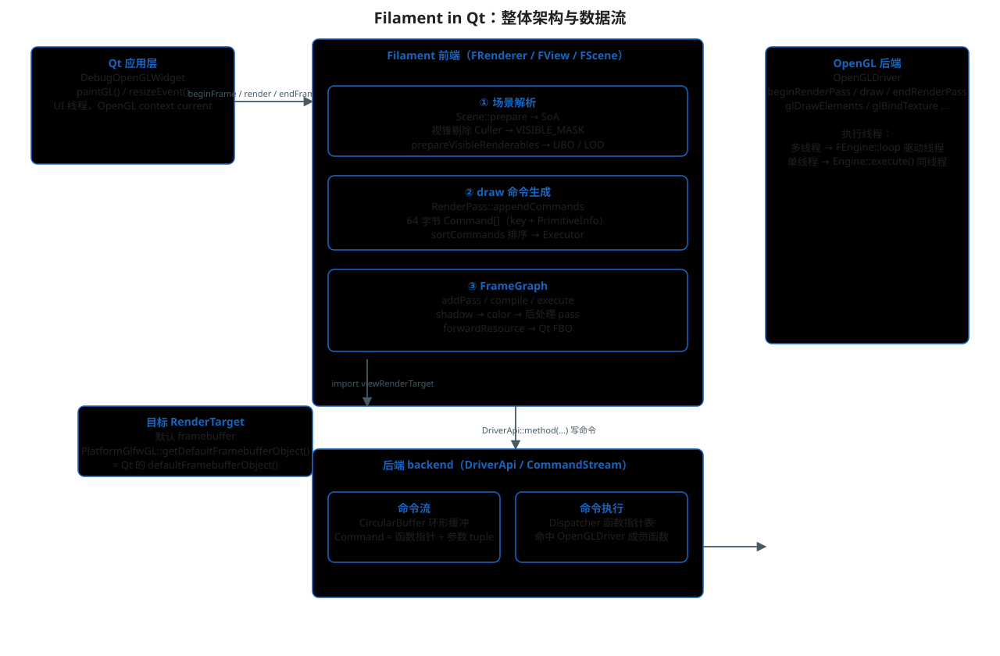
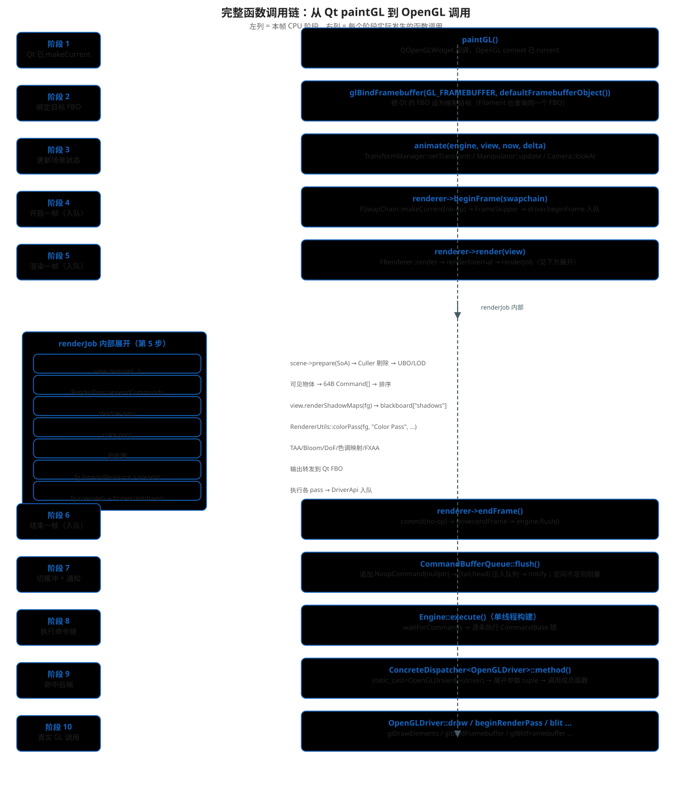

# Filament-in-Qt 渲染架构文档集

> 本目录是 `Qt-Filament` 项目的 Filament 内部机制文档。
> 内容全部基于本仓库实际拉取的 Filament 源码（`filament/` 目录），
> 引用处均标注了源码路径。

## 文档导航

| 文档 | 内容 | 配图 |
|---|---|---|
| [01-scene-pipeline.md](./01-scene-pipeline.md) | 场景解析与剔除：Entity → 组件 → SoA → 视锥剔除 → UBO | `scene-pipeline.svg` |
| [02-renderpass.md](./02-renderpass.md) | RenderPass：64 字节 draw 命令的生成、排序与执行 | `renderpass.svg` |
| [03-framegraph.md](./03-framegraph.md) | FrameGraph：虚拟资源、依赖图、pass 生命周期 | `framegraph.svg` |
| [04-arena.md](./04-arena.md) | Arena 分配器：一帧内的三层线性内存 | `arena.svg` |
| [05-command-stream.md](./05-command-stream.md) | 命令流：环形缓冲、生产消费、Dispatcher 分发 | `command-stream.svg` |
| [06-qt-integration.md](./06-qt-integration.md) | Qt 集成层：PlatformGlfwGL、SwapChain、FBO 链路 | `qt-integration.svg` |
| [07-performance-analysis.md](./07-performance-analysis.md) | 性能分析：帧时间构成、瓶颈定位、优化路径 | `performance-breakdown.svg` |

## 整体架构



`Qt-Filament` 里渲染一条命令从产生到变成 GPU 调用，跨越四个层次：

1. **Qt 应用层**：`DebugOpenGLWidget::paintGL()`。负责创建 OpenGL 上下文、
   提供绘制目标 FBO、把 Filament 的渲染调用摆在正确的线程和上下文里。
2. **Filament 前端**：`FRenderer::render(view)`。负责"想清楚本帧画什么"——
   解析场景、剔除、生成 draw 命令、组织 FrameGraph 各 pass。
   前端只往 `DriverApi`（`CommandStream`）里写命令，不直接碰 OpenGL。
3. **命令流**：`CommandStream` + `CircularBuffer` + `CommandBufferQueue`。
   命令以"函数指针 + 参数 tuple"的形式写入环形缓冲，由消费者线程取出执行。
4. **OpenGL 后端**：`OpenGLDriver` 的成员函数最终被命令命中，产生真实 GL 调用。

> 本项目构建时定义了 `FILAMENT_SINGLE_THREADED`（见 `Build/` 下各 `.vcxproj`），
> 所以第 3、4 层没有独立驱动线程，命令由 `Engine::execute()` 在 GUI 线程上执行。

## 完整函数调用链



一次 `paintGL()` 的完整链路（对应图里的 10 个阶段）：

```text
paintGL()
 └─ glBindFramebuffer(Qt FBO)                      # 阶段 2：绑定绘制目标
    └─ animate(...)                                # 阶段 3：更新变换/相机（纯 CPU）
       └─ renderer->beginFrame(swapchain)          # 阶段 4：入队 beginFrame
          └─ renderer->render(view)                # 阶段 5：场景解析 + FrameGraph + 入队 draw 命令
             └─ renderer->endFrame()               # 阶段 6：入队 commit/endFrame
                └─ engine->execute()               # 阶段 7-10：执行命令链 → OpenGLDriver → GL
```

阶段 1~6 是"入队阶段"（CPU 上构造命令），阶段 7~10 是"执行阶段"
（命令变成真实 GL 调用）。两者之间靠环形缓冲解耦——这正是多线程构建下
驱动线程独立工作的基础。

## 阅读顺序建议

1. 先读 [05-command-stream.md](./05-command-stream.md) 理解"命令从哪来到哪去"，
   这是 Filament 架构的骨架；
2. 再读 [01-scene-pipeline.md](./01-scene-pipeline.md) 和
   [02-renderpass.md](./02-renderpass.md)，理解前端如何把场景变成命令；
3. 接着读 [03-framegraph.md](./03-framegraph.md) 看命令如何被组织进帧图执行；
4. [04-arena.md](./04-arena.md) 解释这些临时对象的内存从哪来；
5. 最后读 [06-qt-integration.md](./06-qt-integration.md) 把整条链映射回本项目。

## 图怎么来的

`diagrams/` 下的 SVG 由 [generate_diagrams.py](./diagrams/generate_diagrams.py)
生成（纯标准库，无依赖）。改了源码结论后，用下面命令重新生成：

```text
python docs/diagrams/generate_diagrams.py
```

同名 PNG 是同一脚本输出后栅格化的预览图。
